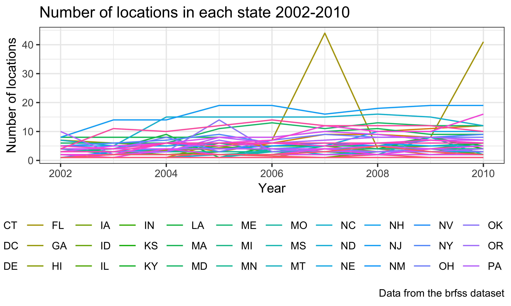
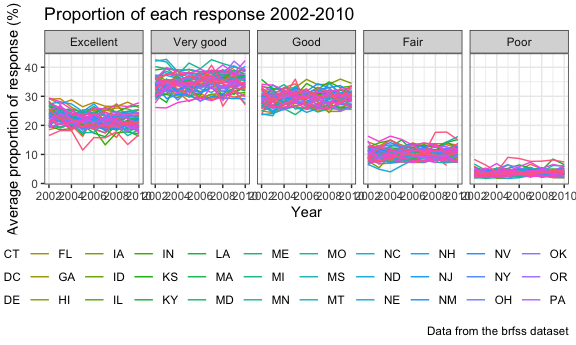
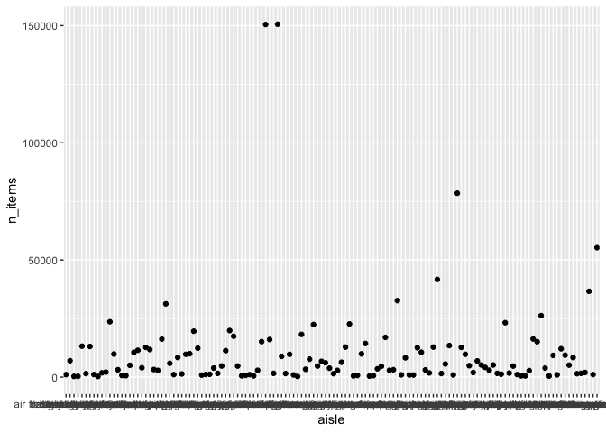

p8105\_hw3\_xz2788
================
Xiaoyue Zhang
10/4/2018

Problem 1
=========

Load dataset and package

``` r
library(p8105.datasets)
library(tidyverse)
```

    ## ── Attaching packages ───────────────────────────────────────────────── tidyverse 1.2.1 ──

    ## ✔ ggplot2 3.0.0     ✔ purrr   0.2.5
    ## ✔ tibble  1.4.2     ✔ dplyr   0.7.6
    ## ✔ tidyr   0.8.1     ✔ stringr 1.3.1
    ## ✔ readr   1.1.1     ✔ forcats 0.3.0

    ## ── Conflicts ──────────────────────────────────────────────────── tidyverse_conflicts() ──
    ## ✖ dplyr::filter() masks stats::filter()
    ## ✖ dplyr::lag()    masks stats::lag()

Look at the data first

``` r
str(brfss_smart2010)
head(brfss_smart2010)
tail(brfss_smart2010)
View(brfss_smart2010)
```

Tidy the data

``` r
brfss_smart2010_tidy = janitor::clean_names(brfss_smart2010) %>%
  filter(topic == "Overall Health") %>% 
  rename(state = locationabbr, county = locationdesc) %>% 
  filter(response %in% c("Excellent", "Very good", "Good", "Fair", "Poor"))
```

Convert the "response" variable into a factor

``` r
brfss_smart2010_tidy$response = factor(brfss_smart2010_tidy$response, 
                      levels = c("Excellent", "Very good", "Good", "Fair", "Poor"))
```

which states were observed at 7 locations
-----------------------------------------

``` r
brfss_smart2010_tidy %>% 
  group_by(state) %>% 
  summarize(n_location = n_distinct(geo_location)) %>% 
  filter(n_location == 7)
```

    ## # A tibble: 7 x 2
    ##   state n_location
    ##   <chr>      <int>
    ## 1 CT             7
    ## 2 MT             7
    ## 3 NH             7
    ## 4 NM             7
    ## 5 OR             7
    ## 6 TN             7
    ## 7 UT             7

There are seven states were observed at 7 locations. These are: "Connecticut (CT)", "Montana (MT)", "New Hampshire (NH)", "New Mexico (NM)", "Oregon (OR)", "Tennessee (TN)", "Utah (UT)"

"Spaghetti plot"
----------------

``` r
brfss_smart2010_tidy %>% 
  group_by(state, year) %>% 
  summarize(n_obs = sum(sample_size)) %>% 
  ggplot(aes(x = year, y = n_obs)) + 
  geom_line(aes(color = state)) +
  labs(
    title = "Observation plot",
    x = "Year",
    y = "Number of observations"
  )
```



Making a table
--------------

``` r
filter(brfss_smart2010_tidy, 
       state == "NY",
       year %in% c(2002, 2006, 2010),
       response == "Excellent") %>%
  group_by(year) %>% 
  summarize(sd_prop = sd(data_value),
            mean_prop = mean(data_value)) %>% 
  knitr::kable(digits = 2)
```

|  year|  sd\_prop|  mean\_prop|
|-----:|---------:|-----------:|
|  2002|      4.49|       24.04|
|  2006|      4.00|       22.53|
|  2010|      3.57|       22.70|

Five-panel plot
---------------

``` r
brfss_smart2010_tidy %>% 
  group_by(state, year, response) %>% 
  summarize(average_prop = mean(data_value)) %>% 
  ggplot(aes(x = year, y = average_prop)) +
  geom_line(aes(color = state)) +
  facet_grid(. ~ response) +
   theme(legend.position = "bottom")
```

    ## Warning: Removed 1 rows containing missing values (geom_path).



Problem 2
=========

View the data first

``` r
View(instacart)
head(instacart)
tail(instacart)
str(instacart)
dim(instacart)
skimr::skim(instacart)
```

There are 1,384,617 observations and 15 variables in this dataset. Each row represents a product from an online order and contains information about the time of the order, product of the order, the previous ordering history from this same customer. Only the evaluation set that the order belongs to, product name, aisle identifier and name of department are character variables. Others are integers. There are no missing values in the dataset.

For example, in the first row, it shows the product "Bulgarian Yogurt" ordered by the user with ID "112108" and it was ordered from the cart at 10:00 am on Thursday. This customer also bought this same product 9 days ago.

How many aisles and which are the most items ordered from?
----------------------------------------------------------

``` r
n_distinct(instacart$aisle_id, na.rm = TRUE)
```

    ## [1] 134

``` r
instacart %>% 
  group_by(aisle) %>% 
  summarize(n_items = n()) %>% 
  filter(n_items == max(n_items))
```

    ## # A tibble: 1 x 2
    ##   aisle            n_items
    ##   <chr>              <int>
    ## 1 fresh vegetables  150609

There are in total 134 aisles and the aisle of "fresh vegetables" is the most items ordered from.

Plot of the number of items ordered in each aisle
-------------------------------------------------

``` r
instacart %>% 
  group_by(aisle) %>% 
  summarize(n_items = n()) %>% 
  ggplot(aes(x = aisle, y = n_items)) +
  geom_point()
```



Table showing the most popular item in three specific aisles
------------------------------------------------------------

``` r
instacart %>% 
  filter(aisle %in%
           c("baking ingredients", "dog food care", "packaged vegetables fruits")) %>% 
  group_by(aisle, product_name) %>% 
  summarize(n_products = n()) %>% 
  filter(n_products == max(n_products)) %>% 
  knitr::kable()
```

| aisle                      | product\_name                                 |  n\_products|
|:---------------------------|:----------------------------------------------|------------:|
| baking ingredients         | Light Brown Sugar                             |          499|
| dog food care              | Snack Sticks Chicken & Rice Recipe Dog Treats |           30|
| packaged vegetables fruits | Organic Baby Spinach                          |         9784|

The most popular item in "baking ingredients" is "Light Brown Sugar" with 499 ordering histories. The most popular item in "dog food care" is "Snack Sticks Chicken & Rice Recipe Dog Treats" with 30 ordering histories. The most popular item in "packaged vegetables fruits" is "Organic Baby Spinach" with 9784 ordering histories.

Table showing the mean hour of the day
--------------------------------------

``` r
instacart %>% 
  filter(product_name %in% c("Pink Lady Apples", "Coffee Ice Cream")) %>% 
  group_by(product_name, order_dow) %>% 
  summarize(mean_hour = mean(order_hour_of_day)) %>% 
  spread(key = order_dow, value = mean_hour)
```

    ## # A tibble: 2 x 8
    ## # Groups:   product_name [2]
    ##   product_name       `0`   `1`   `2`   `3`   `4`   `5`   `6`
    ##   <chr>            <dbl> <dbl> <dbl> <dbl> <dbl> <dbl> <dbl>
    ## 1 Coffee Ice Cream  13.8  14.3  15.4  15.3  15.2  12.3  13.8
    ## 2 Pink Lady Apples  13.4  11.4  11.7  14.2  11.6  12.8  11.9
