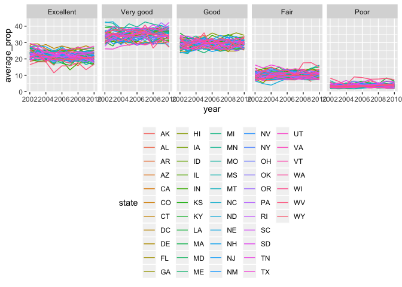

p8105\_hw3\_xz2788
================
Xiaoyue Zhang
10/4/2018

Problem 1
=========

Load dataset and package

``` r
library(p8105.datasets)
library(tidyverse)
```

    ## ── Attaching packages ───────────────────────────────────────────────── tidyverse 1.2.1 ──

    ## ✔ ggplot2 3.0.0     ✔ purrr   0.2.5
    ## ✔ tibble  1.4.2     ✔ dplyr   0.7.6
    ## ✔ tidyr   0.8.1     ✔ stringr 1.3.1
    ## ✔ readr   1.1.1     ✔ forcats 0.3.0

    ## ── Conflicts ──────────────────────────────────────────────────── tidyverse_conflicts() ──
    ## ✖ dplyr::filter() masks stats::filter()
    ## ✖ dplyr::lag()    masks stats::lag()

Look at the data first

``` r
str(brfss_smart2010)
head(brfss_smart2010)
tail(brfss_smart2010)
View(brfss_smart2010)
```

Tidy the data

``` r
brfss_smart2010_tidy = janitor::clean_names(brfss_smart2010) %>%
  filter(topic == "Overall Health") %>% 
  rename(state = locationabbr, county = locationdesc) %>% 
  filter(response %in% c("Excellent", "Very good", "Good", "Fair", "Poor"))
```

Convert the "response" variable into a factor

``` r
brfss_smart2010_tidy$response = factor(brfss_smart2010_tidy$response, 
                      levels = c("Excellent", "Very good", "Good", "Fair", "Poor"))
```

which states were observed at 7 locations
-----------------------------------------

``` r
brfss_smart2010_tidy %>% 
  group_by(state) %>% 
  summarize(n_location = n_distinct(geo_location)) %>% 
  filter(n_location == 7)
```

    ## # A tibble: 7 x 2
    ##   state n_location
    ##   <chr>      <int>
    ## 1 CT             7
    ## 2 MT             7
    ## 3 NH             7
    ## 4 NM             7
    ## 5 OR             7
    ## 6 TN             7
    ## 7 UT             7

There are seven states were observed at 7 locations. These are: "Connecticut (CT)", "Montana (MT)", "New Hampshire (NH)", "New Mexico (NM)", "Oregon (OR)", "Tennessee (TN)", "Utah (UT)"

"Spaghetti plot"
----------------

``` r
brfss_smart2010_tidy %>% 
  group_by(state, year) %>% 
  summarize(n_obs = sum(sample_size)) %>% 
  ggplot(aes(x = year, y = n_obs)) + 
  geom_line(aes(color = state)) +
  labs(
    title = "Observation plot",
    x = "Year",
    y = "Number of observations"
  )
```


Making a table
--------------

``` r
filter(brfss_smart2010_tidy, 
       state == "NY",
       year %in% c(2002, 2006, 2010),
       response == "Excellent") %>%
  group_by(year) %>% 
  summarize(sd_prop = sd(data_value),
            mean_prop = mean(data_value)) %>% 
  knitr::kable(digits = 2)
```

|  year|  sd\_prop|  mean\_prop|
|-----:|---------:|-----------:|
|  2002|      4.49|       24.04|
|  2006|      4.00|       22.53|
|  2010|      3.57|       22.70|

Five-panel plot
---------------

``` r
brfss_smart2010_tidy %>% 
  group_by(state, year, response) %>% 
  summarize(average_prop = mean(data_value)) %>% 
  ggplot(aes(x = year, y = average_prop)) +
  geom_line(aes(color = state)) +
  facet_grid(. ~ response) +
   theme(legend.position = "bottom")
```

    ## Warning: Removed 1 rows containing missing values (geom_path).


