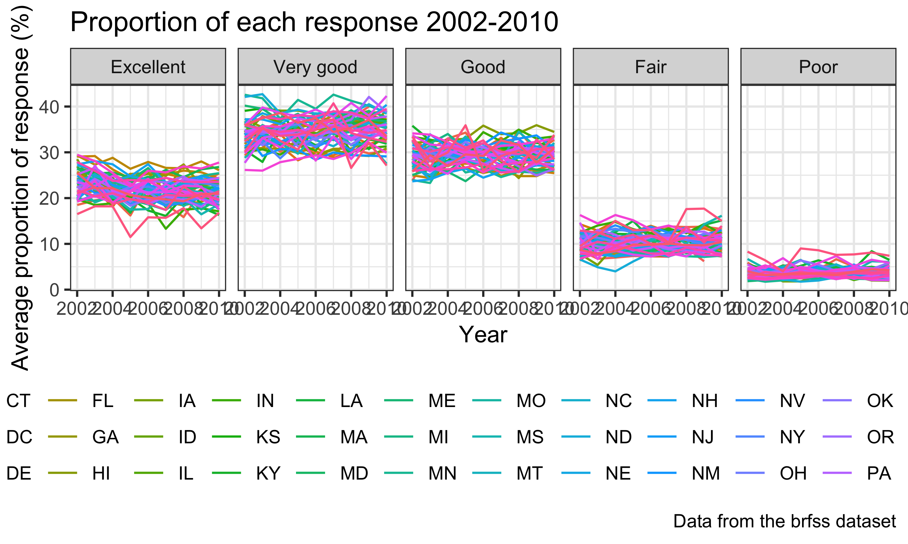
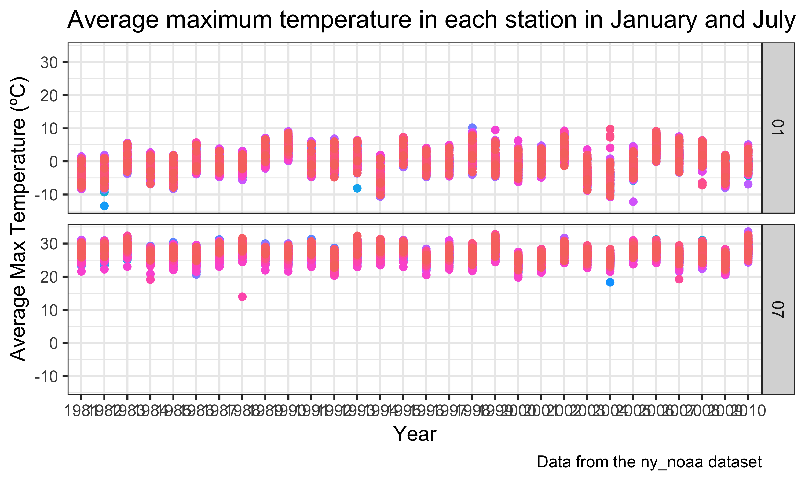

p8105\_hw3\_xz2788
================
Xiaoyue Zhang
10/4/2018

``` r
knitr::opts_chunk$set(
  fig.width = 6,
  fig.asp = .6,
  out.width = "90%"
)
```

Problem 1
=========

Load dataset and package

``` r
library(hexbin)
library(p8105.datasets)
library(tidyverse)
```

    ## ── Attaching packages ───────────────────────────────────────────────── tidyverse 1.2.1 ──

    ## ✔ ggplot2 3.0.0     ✔ purrr   0.2.5
    ## ✔ tibble  1.4.2     ✔ dplyr   0.7.6
    ## ✔ tidyr   0.8.1     ✔ stringr 1.3.1
    ## ✔ readr   1.1.1     ✔ forcats 0.3.0

    ## ── Conflicts ──────────────────────────────────────────────────── tidyverse_conflicts() ──
    ## ✖ dplyr::filter() masks stats::filter()
    ## ✖ dplyr::lag()    masks stats::lag()

``` r
library(patchwork)
data("brfss_smart2010")
```

Look at the data first

``` r
str(brfss_smart2010)
head(brfss_smart2010)
tail(brfss_smart2010)
View(brfss_smart2010)
```

Tidy the data

``` r
brfss_smart2010_tidy = janitor::clean_names(brfss_smart2010) %>%
  filter(topic == "Overall Health") %>% 
  rename(state = locationabbr, county = locationdesc) %>% 
  filter(response %in% c("Excellent", "Very good", "Good", "Fair", "Poor"))
```

Convert the "response" variable into a factor

``` r
brfss_smart2010_tidy$response = factor(brfss_smart2010_tidy$response, 
                      levels = c("Excellent", "Very good", "Good", "Fair", "Poor"))
```

which states were observed at 7 locations in 2002
-------------------------------------------------

``` r
brfss_smart2010_tidy %>% 
  filter(year == 2002) %>% 
  group_by(state) %>% 
  summarize(n_location = n_distinct(geo_location)) %>% 
  filter(n_location == 7)
```

    ## # A tibble: 3 x 2
    ##   state n_location
    ##   <chr>      <int>
    ## 1 CT             7
    ## 2 FL             7
    ## 3 NC             7

There are three states were observed at 7 locations. These are: "Connecticut (CT)", "Florida (FL)", "North Carolina (NC)"

"Spaghetti plot"
----------------

``` r
brfss_smart2010_tidy %>% 
  group_by(state, year) %>% 
  summarize(n_locat = sum(n_distinct(geo_location, na.rm = TRUE))) %>% 
  ggplot(aes(x = year, y = n_locat)) + 
  geom_line(aes(color = state)) +
  theme_bw() +
  labs(
    title = "Number of locations in each state 2002-2010",
    x = "Year",
    y = "Number of locations",
    caption = "Data from the brfss dataset"
  ) +
  theme(legend.position = "bottom") +
  guides(col = guide_legend(nrow = 3))
```


FL state has the highest number of locations in the year of 2007, but some of these stations did not conduct the study every year. Most of the state only have less than 10 locations.

Making a table
--------------

``` r
filter(brfss_smart2010_tidy, 
       state == "NY",
       year %in% c(2002, 2006, 2010),
       response == "Excellent") %>%
  group_by(year) %>% 
  summarize(sd_prop = sd(data_value),
            mean_prop = mean(data_value)) %>% 
  knitr::kable(digits = 2)
```

|  year|  sd\_prop|  mean\_prop|
|-----:|---------:|-----------:|
|  2002|      4.49|       24.04|
|  2006|      4.00|       22.53|
|  2010|      3.57|       22.70|

From 2002 to 2010, the mean proportion of "Excellence" response decreased from 24% to 22.7% in New York City, and the standard deviations were also decreasing which showed that different proportions of "Excellence" in different locations in NY was smaller.

Five-panel plot
---------------

``` r
brfss_smart2010_tidy %>% 
  group_by(state, year, response) %>% 
  summarize(average_prop = mean(data_value, na.rm = TRUE)) %>% 
  ggplot(aes(x = year, y = average_prop)) +
  geom_line(aes(color = state)) +
  facet_grid(. ~ response) +
  theme_bw() +
  labs(
    title = "Proportion of each response 2002-2010",
    x = "Year",
    y = "Average proportion of response (%)",
    caption = "Data from the brfss dataset"
  ) +
   theme(legend.position = "bottom") +
  guides(col = guide_legend(nrow = 3))
```



Through the years, the proportion of each response floated up and down, but most of people have "Very good", "Good" and "Excellent" response. Those states which had high proportion of "Fair" or "Poor" were also likely to have low proportion of good positive responses.

Problem 2
=========

Load the data

``` r
data("instacart")
```

View the data first

``` r
View(instacart)
head(instacart)
tail(instacart)
str(instacart)
dim(instacart)
skimr::skim(instacart)
```

There are 1,384,617 observations and 15 variables in this dataset. Each row represents a product from an online order and contains information about the time of the order, product of the order, the previous ordering history from this same customer. Only the evaluation set that the order belongs to, product name, aisle identifier and name of department are character variables. Others are integers. There are no missing values in the dataset.

For example, in the first row, it shows the product "Bulgarian Yogurt" ordered by the user with ID "112108" and it was ordered from the cart at 10:00 am on Thursday. This customer also bought this same product 9 days ago.

How many aisles and which are the most items ordered from?
----------------------------------------------------------

``` r
n_distinct(instacart$aisle_id, na.rm = TRUE)
```

    ## [1] 134

``` r
instacart %>% 
  group_by(aisle) %>% 
  summarize(n_items = n()) %>% 
  filter(n_items == max(n_items))
```

    ## # A tibble: 1 x 2
    ##   aisle            n_items
    ##   <chr>              <int>
    ## 1 fresh vegetables  150609

There are in total 134 aisles and the aisle of "fresh vegetables" is the most items ordered from.

Plot of the number of items ordered in each aisle
-------------------------------------------------

Because of the large sample, divide into 3 groups for plotting

``` r
desc_instacart = instacart %>% 
  group_by(aisle) %>% 
  summarize(n_items = n()) %>% 
  arrange(-n_items) 
group_1 = desc_instacart[1:45,]
group_2 = desc_instacart[45:90,]
group_3 = desc_instacart[91:134,]
```

Plotting three plot seperately and then combine

``` r
group_1 %>%  
  transform(aisle = reorder(aisle, -n_items)) %>% 
  ggplot(aes(x = aisle, y = n_items)) +
  geom_bar(stat = "identity") +
  theme_bw() +
  geom_text(aes(label = n_items)) +
  labs(
    title = "Number of products ordered in each aisle",
    x = "Aisle",
    y = "Number of products",
    caption = "Data from the instacart dataset"
  ) +
  coord_flip()
```


``` r
group_2 %>%  
  transform(aisle = reorder(aisle, -n_items)) %>% 
  ggplot(aes(x = aisle, y = n_items)) +
  geom_bar(stat = "identity") +
  theme_bw() +
  geom_text(aes(label = n_items)) +
  labs(
    title = "Number of products ordered in each aisle",
    x = "Aisle",
    y = "Number of products",
    caption = "Data from the instacart dataset"
  ) +
  coord_flip()
```


``` r
group_3 %>%  
  transform(aisle = reorder(aisle, -n_items)) %>% 
  ggplot(aes(x = aisle, y = n_items)) +
  geom_bar(stat = "identity") +
  theme_bw() +
  geom_text(aes(label = n_items)) +
  labs(
    title = "Number of products ordered in each aisle",
    x = "Aisle",
    y = "Number of products",
    caption = "Data from the instacart dataset"
  ) +
  coord_flip()
```


Comment: The most popular aisles are "fresh fruits" and "fresh vegetables", there are over 150000 items ordered from each aisle. The least popular aisle is "beauty" which is less than 300.

Table showing the most popular item in three specific aisles
------------------------------------------------------------

``` r
instacart %>% 
  filter(aisle %in%
           c("baking ingredients", "dog food care", "packaged vegetables fruits")) %>% 
  group_by(aisle, product_name) %>% 
  summarize(n_products = n()) %>% 
  filter(n_products == max(n_products)) %>% 
  knitr::kable()
```

| aisle                      | product\_name                                 |  n\_products|
|:---------------------------|:----------------------------------------------|------------:|
| baking ingredients         | Light Brown Sugar                             |          499|
| dog food care              | Snack Sticks Chicken & Rice Recipe Dog Treats |           30|
| packaged vegetables fruits | Organic Baby Spinach                          |         9784|

The most popular item in "baking ingredients" is "Light Brown Sugar" with 499 ordering histories. The most popular item in "dog food care" is "Snack Sticks Chicken & Rice Recipe Dog Treats" with 30 ordering histories. The most popular item in "packaged vegetables fruits" is "Organic Baby Spinach" with 9784 ordering histories.

Table showing the mean hour of the day
--------------------------------------

``` r
instacart$order_dow = recode(instacart$order_dow, `0` = "Sunday", `6` = "Saturday", `5` = "Friday", `4` = "Thursday", `3` = "Wednesday", `2` = "Tuesday", `1` = "Monday") 
instacart$order_dow = factor(instacart$order_dow, levels = c("Sunday", "Monday", "Tuesday", "Wednesday", "Thursday", "Friday", "Saturday"))

instacart %>% 
  filter(product_name %in% c("Pink Lady Apples", "Coffee Ice Cream")) %>% 
  group_by(product_name, order_dow) %>% 
  summarize(mean_hour = round(mean(order_hour_of_day))) %>% 
  spread(key = order_dow, value = mean_hour) %>% 
  knitr::kable() 
```

| product\_name    |  Sunday|  Monday|  Tuesday|  Wednesday|  Thursday|  Friday|  Saturday|
|:-----------------|-------:|-------:|--------:|----------:|---------:|-------:|---------:|
| Coffee Ice Cream |      14|      14|       15|         15|        15|      12|        14|
| Pink Lady Apples |      13|      11|       12|         14|        12|      13|        12|

People usually buy coffee ice cream in the afternoon of the day, just after lunch, but for Friday, the time is a little bit earlier. The ordering time of pink lady apples are earlier than that of coffee ice cream, almost at noon. The ordering time among days of the week does not vary a lot.

Problem 3
=========

Load the data

``` r
data("ny_noaa")
```

View the data first

``` r
head(ny_noaa)
tail(ny_noaa)
str(ny_noaa)
skimr::skim(ny_noaa)
View(ny_noaa)
```

There are 2,595,176 observations and 7 variables. It mainly contains the information of the date, maximum and minimum temperature (tenths of degrees C), total precipitation (tenths of mm) of the day, snow fall (mm) and snow depth (mm). "date" is a Date variable, station ID, maximum temperature, minimum temperature are character variables and all of the others are integers. Except ID and date, all the variables have missing values. Because it didn't rain or snow for some days in some stations and also some stations only collect part of the variables. Missing value can be an issue when one station does not collect the data of some variables, R will consider it as zero which means no rain or snow. In this kind of situation, NA can effect the result.

Tidy the data

``` r
ny_noaa_tidy = ny_noaa %>%
  janitor::clean_names() %>%
  separate(date, into = c("year", "month", "day"), sep = "-") %>% 
  mutate(tmax = as.numeric(tmax), tmin = as.numeric(tmin)) %>% 
  mutate(prcp = prcp/10, tmax = tmax/10, tmin = tmin/10)
```

Which value of snowfall is most observed?
-----------------------------------------

``` r
ny_noaa_tidy %>% 
  filter(!is.na(snow)) %>%
  group_by(snow) %>% 
  summarize(n_value = n()) %>% 
  filter(n_value == max(n_value))
```

    ## # A tibble: 1 x 2
    ##    snow n_value
    ##   <int>   <int>
    ## 1     0 2008508

Thus, for snowfall, the most commonly observed value is 0. Because I firstly filter the all the data from "snow" which is not an NA. The left data of snowfall is actually the data that stations documented instead of missing value. 0 means it didn't snow at that day.

Making a plot of average max temperatures in January and July
-------------------------------------------------------------

``` r
ny_noaa_tidy %>% 
  filter(month %in% c("01", "07")) %>% 
  group_by(year, month, id) %>% 
  summarize(average_tmax = mean(tmax, na.rm = TRUE)) %>% 
  ggplot(aes(x = year, y = average_tmax)) +
  geom_point(aes(color = id)) +
  facet_grid(month ~ .) +
  theme_bw() +
  theme(legend.position = "none") +
  labs(
    title = "Average maximum temperature in each station in January and July",
    x = "Year",
    y = "Average Max Temperature (ºC)",
    caption = "Data from the ny_noaa dataset"
  ) 
```

    ## Warning: Removed 5970 rows containing missing values (geom_point).



Before 1994, if the maximum temperature was decreasing in January comparing with the previous year, the maximum temperature in July would increase instead; but after 1994, the trends of maximum temperature in January and July were the same. It was like a three-year circle in which continuous decreasing for three years followed by the increasing. There were some outliers. In the year of 1982, the place where USC00301723 station located had the lowest temperature of -13.4ºC in January. In 1988, the place where USC00308962 station located had the lowest temperature of 14.0ºC in July. There were also some outliers in January in the year of 1993, 2004, 2005, 2008, 2010 and in July in the year of 2004, 2007.

Making a plot for tmax vs tmin
------------------------------

``` r
tmax_tmin_plot = ny_noaa_tidy %>% 
  ggplot(aes(x = tmax, y = tmin)) +
  theme_bw() +
  geom_hex() +
  theme(legend.position = "bottom", legend.key.width = unit(1,"cm")) +
  labs(
    title = "Maximum temperature VS minimum temperature",
    x = "Maximum temperature (ºC)",
    y = "Minimum temperature (ºC)",
    caption = "Data from the ny_noaa dataset"
  ) 
```

From the hex plot, we can see that the highest density is in the middle when max temperature is around 5ºC while the minimum temperature is around 0ºC and also the max temperature is around 25ºC when the minimum is around 15ºC.

Making a plot for distribution of snowfall
------------------------------------------

``` r
snowfall_plot = ny_noaa_tidy %>% 
  filter(snow > 0, snow < 100) %>% 
  group_by(year) %>% 
  ggplot(aes(x = snow, fill = year)) +
  geom_density(alpha = .5) +
  theme_bw() +
  labs(
    title = "Snowfall distribution through years",
    x = "snowfall (mm)",
    y = "Density",
    caption = "Data from the ny_noaa dataset"
  ) +
  theme(legend.position = "bottom") +
  guides(col = guide_legend(nrow = 3)) 
```

Gather the two plots together

``` r
tmax_tmin_plot + snowfall_plot
```

    ## Warning: Removed 1136276 rows containing non-finite values (stat_binhex).


